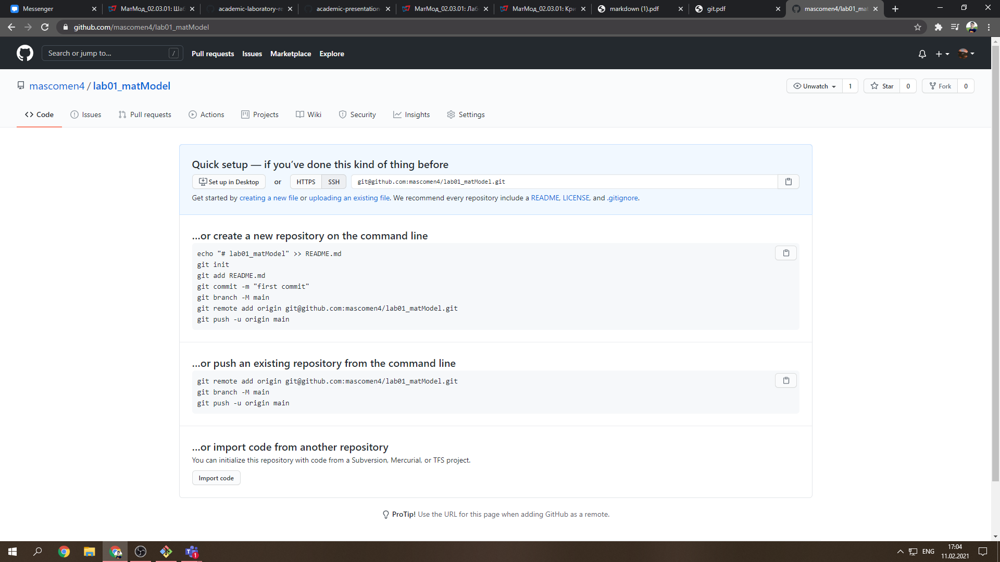
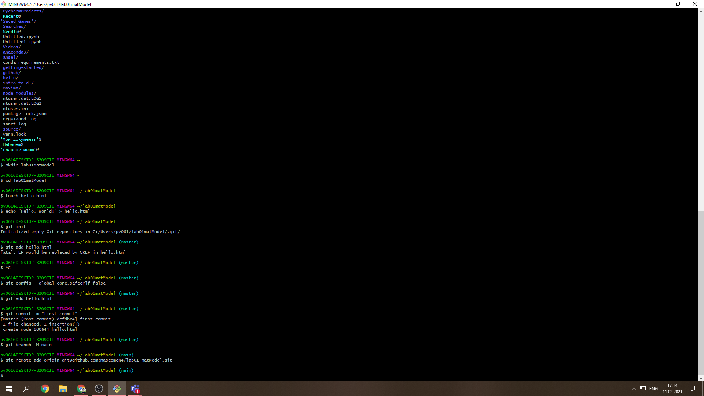
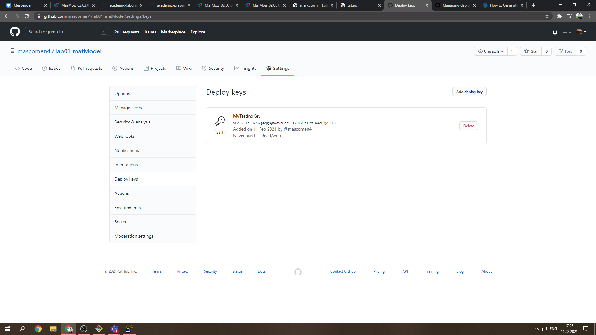
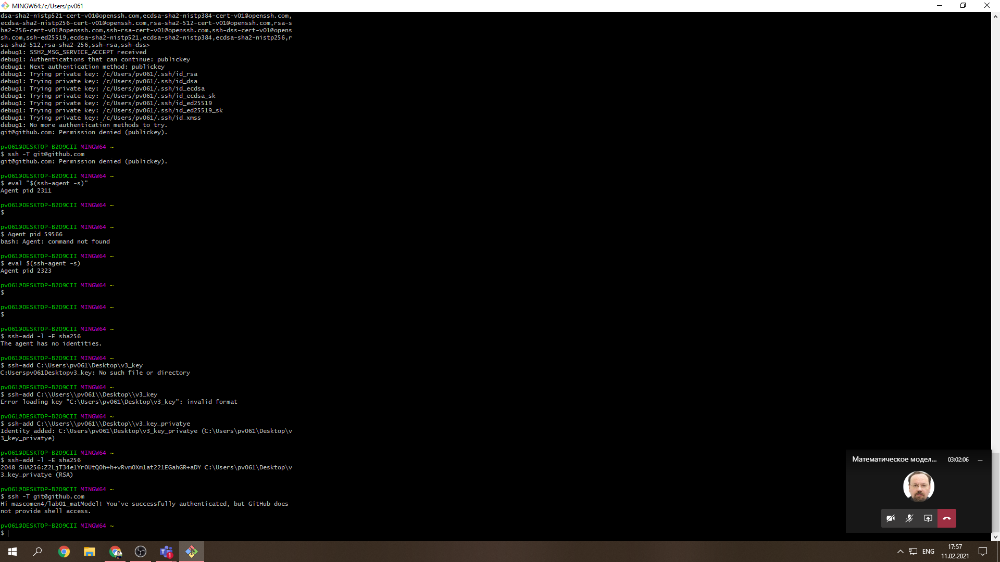
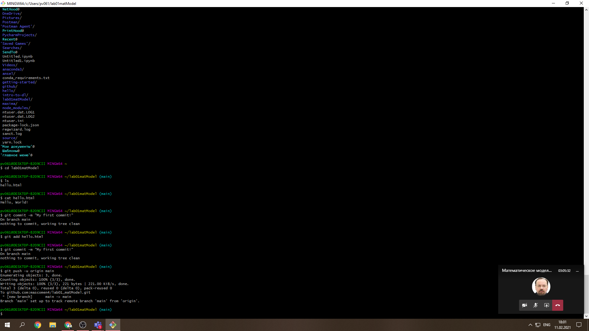
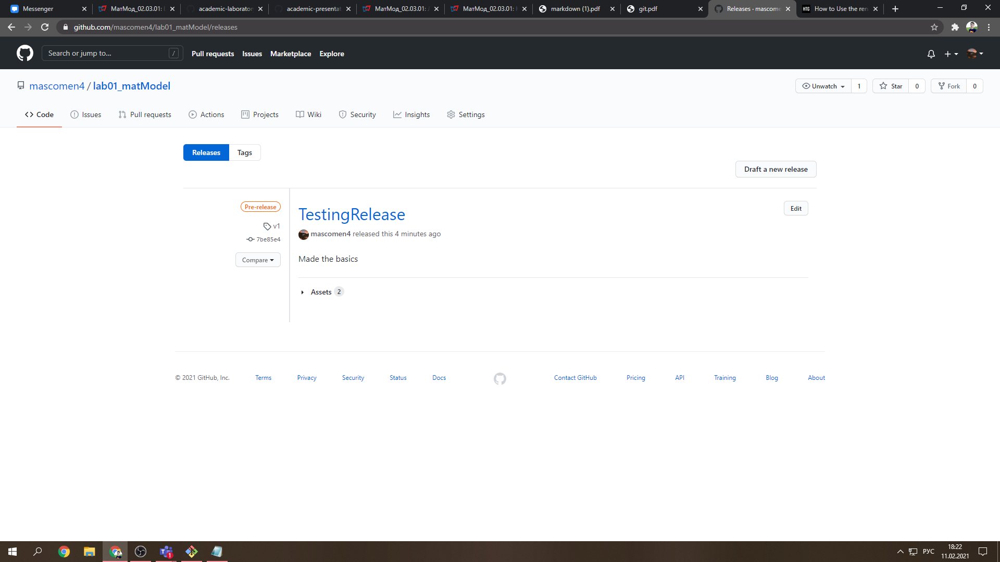

# Российский Университет Дружбы Народов. 
# "Отчет по лабораторной работе номер 1"
# Выполнил: "Подмогильный Иван Александрович"
## Группа: НКН-бд-01-18
# Преподаватель: "Кулябов Дмитрий Сергеевич"

# Цель работы

Ознакомление и вспоминание работы с системой контроля версий git. 

# Задание

1. Создать репозиторий
2. Создание и загрузка каталогов 
3. Коммит
4. Релиз
5. Формирование отчета
6. Создание финального релиза

# Выполнение лабораторной работы

Создал репозиторий на гитхаб (рис.1)

{ Изображение 1 }

{ Изображение 2 }

Загрузил и подключил SSH ключи (рис.2)

{ Изображение 3 }

{ Изображение 4 }

Создал файл hello.html, и закомиттил, запушил его  (рис.3)

{ Изображение 5 }

Сделал testing релиз на гитхаб (рис.4)

{ Изображение 6 }

# Выводы

Вспомнил как решать issues на гитхаб, как делать коммиты и пушить их. Узнал, что еще можно делать релизы. Познакомился с Markdown.
